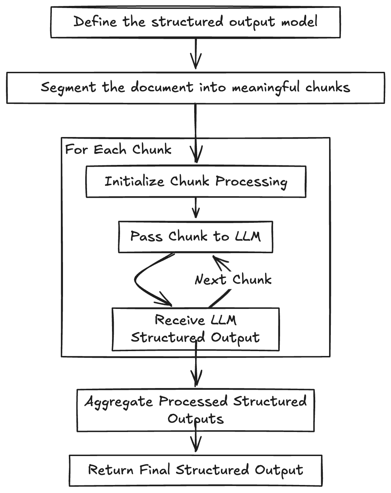

# Long Document Structured Extraction

## Problem

Augmentation is one of the fundamental units of an LLM-based system. Read more about it at [Are AI Agents Nothing But Multiple RAGs? — Innowhyte](https://www.innowhyte.com/blogs/are-ai-agents-nothing-but-multiple-rags). However, augmentation has its challenges. One of the challenges is that of the LLM in-context recall.

LLM refers to the model's ability to retrieve and utilize information presented within the same prompt. This capability is crucial for tasks such as data extraction.

Recent studies have highlighted that an LLM's in-context recall performance can be significantly influenced by the phrasing of prompts. Even minor changes in wording can affect the model's ability to retrieve pertinent information, underscoring the importance of careful prompt design to optimize recall efficiency.

The less the context, the more the LLM's ability to recall information and the more reliable and predictable the output.

This pattern allows extracting structured output from a long document with improved accuracy, reliability, and predictability.

## Condition

- This pattern applies to documents where paragraphs are closely connected. Understanding or inferring the content of one paragraph or section should rely on another that is on the same page or just a paragraph away.
- This pattern is applicable where latency is not a problem.

## Use cases

- Structured work experience extraction from a long resume \(more than 3-4 pages\)
- Structured extraction of transactions from credit card statement

## Solution

The solution consists of the following steps:

1. **Define the structured output model** – Establish the expected format for the extracted information.
    - Considerations:
        - Avoid designing a model with multiple nested levels.
        - If the use case requires deeper nesting, reconsider the design and explore whether nesting can be handled through post-processing instead.
2. **Segment the document into meaningful chunks** – Break the content into logically distinct pieces.
    - Considerations:
        - Handling visual-first document formats like PDFs presents challenges in programmatic logical chunking. To improve this process, test different parsers suited to your use case and convert the PDF into a structure-first format, such as Markdown, for better chunking.
3. **Process each chunk with the LLM** – Iterate over the chunks, passing them to the LLM along with the defined structured output model.
    - Considerations:
        - Repeatedly calling LLMs can be time-consuming. If feasible for your use case, consider parallelizing the process to improve efficiency.

## Considerations

- If your system and structured output prompt are significantly larger than the actual context, the overall cost will be slightly affected. Maintaining a balanced ratio is essential. Additionally, costs can be further reduced by utilizing prompt caching when applicable.

## Benefits

- Enables evaluation with different LLMs without being restricted by their context size. It also allows the use of smaller language models depending on the chunk size.
- Simplifies testing by allowing experimentation with smaller, varied chunks.
- Enhances the predictability of probabilistic LLM systems.

## Tradeoffs

- Improves extraction reliability, but increases orchestration complexity.
- Works with smaller context windows, but may increase total latency and request count.
- Better control per chunk, but needs robust merging and deduplication logic.

## Failure Modes

- Chunk boundaries split dependent facts, causing incomplete records.
- Different chunks extract overlapping entities with conflicting values.
- Parallel chunk processing creates ordering or merge conflicts.
- Prompt/schema drift across runs causes inconsistent structured outputs.

## Example

For a 6-page resume, split by logical sections, extract work experiences per chunk into a shared schema, then merge entries by company-role-date keys and resolve conflicts.

## References (Optional)

- [Are AI Agents Nothing But Multiple RAGs? — Innowhyte](https://www.innowhyte.com/blogs/are-ai-agents-nothing-but-multiple-rags)
